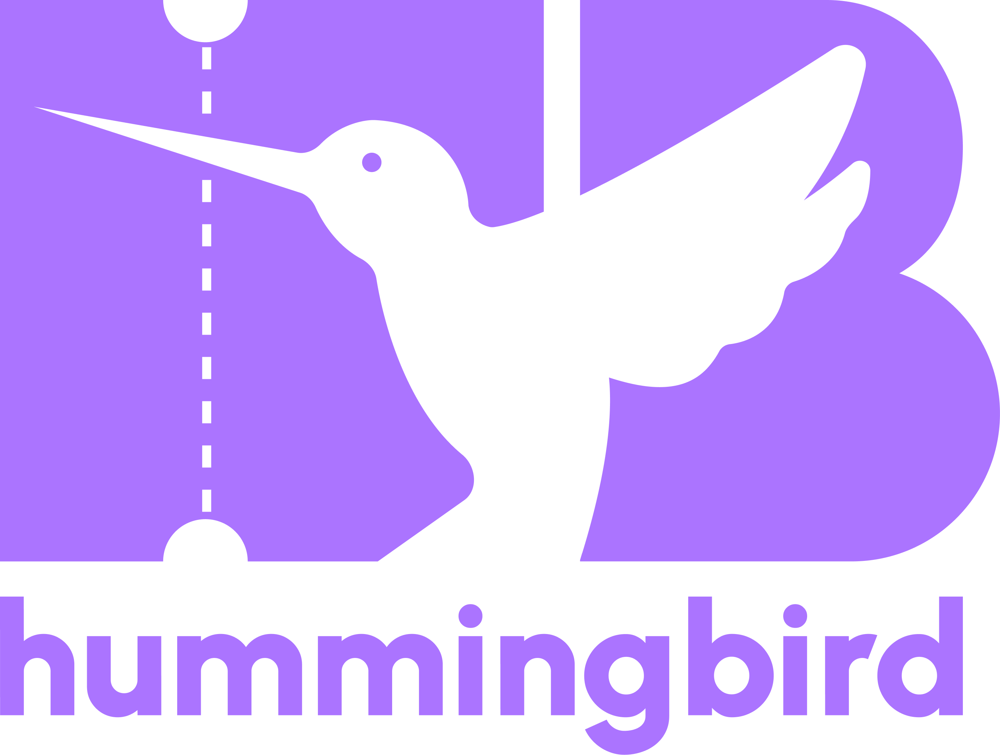
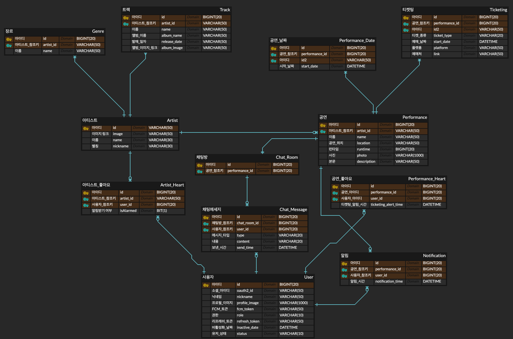

# 🐦 Humming-Bird Backend

 

 

> 허밍버드 프로젝트는 공연 알림 서비스를 제공하는 프로젝트입니다.  
> 해당 레포지토리는 허밍버드 백엔드 전용 레포지토리입니다.

 

### 목차

1. [개요](#개요)
2. [서비스 기능](#서비스-기능)
3. [프로젝트 설계](#프로젝트-설계)
4. [개발 환경 및 기술 스택](#개발-환경-및-기술-스택)
5. [팀원 소개](#팀원-소개)

 
 

## [개요](#목차)

> **개발 기간** : `2023-09-27 ~ 2024-02-29`

|Repository|
|:--------:|
|     [📌 Frontend](https://github.com/Naegongal-Team/HummingBird-Front)        |  

 

#### 허밍버드 서비스

- 외국 가수의 한국 내한 일정과 티켓팅 정보를 효율적으로 제공하여 사용자들이 놓치지 않고 원하는 공연에 참석할 수 있도록 돕는 내한 공연 알리미 어플입니다.
- 이 서비스를 통해 사용자들은 더욱 간편하게 외국 가수의 내한 공연에 참여할 수 있습니다.
    - 내한 공연 정보가 다양한 플랫폼에 분산되어 있어 발생하는 정보 수집의 어려움을 최소화할 수 있습니다.
    - 알림을 통해 티켓팅 정보를 제공하여 사용자들이 원하는 공연을 놓치지 않고 참석할 수 있도록 도와줍니다.

 
 

## [서비스 기능](#목차)

- 내한 공연 일정 제공
- 티켓팅 정보 제공
- 알림 기능
- 채팅 기능
- 사용자 편의 기능
    - 선호하는 공연과 가수 설정

 
 

## [프로젝트 설계](#목차)

### 시스템 아키텍쳐

 

### ERD

 

### API 명세서

 
 

## [개발 환경 및 기술 스택](#목차)

|  개발 환경  | 기술 스택                                                                                                                                                                                                                                                                                                                                                                                                                                                                                                                                                                                                                                                                                                                                                                                                                                                                                                                                        |
|:-------:|:---------------------------------------------------------------------------------------------------------------------------------------------------------------------------------------------------------------------------------------------------------------------------------------------------------------------------------------------------------------------------------------------------------------------------------------------------------------------------------------------------------------------------------------------------------------------------------------------------------------------------------------------------------------------------------------------------------------------------------------------------------------------------------------------------------------------------------------------------------------------------------------------------------------------------------------------|
| **백엔드** |           |
|  **테스트**  |                                                                                                                                                                                                                                                                                                                                                                                                                                                                                                                                                                                                                                                                                                                                                                            |
|   **DB**    |                                                                                                                                                                                                                                                                                                                                                                                                                                                                                                                                                                                                                         |
|   **인프라**   |                                                                                                                                                                                                                                                                                                                                                                                                                                                                                                    |
|   **협업툴**   |                                                                                                                                                                                                                                                                                                                                                                                      |
| **외부 API**  |                                                                                                                                                                                                                                                                                                                                                                                                                                                                                                                                                                                                                                                                                                                                                                                                                                  |

 
 

## [팀원 소개](#목차)

|                     **[손지민](https://github.com/jmxx219)**                      |                   **[전현근](https://github.com/thisfetch1591)**                   |                   **[최이주](https://github.com/cherryiJuice)**                    |
|:------------------------------------------------------------------------------:|:-------------------------------------------------------------------------------:|:-------------------------------------------------------------------------------:|
|  |  |  |
|                                 공연 및 채팅 기능 개발                                  |                                  가수 및 알림 기능 개발                                  |                                유저 기능 개발 및 인프라 구축                                |

 
